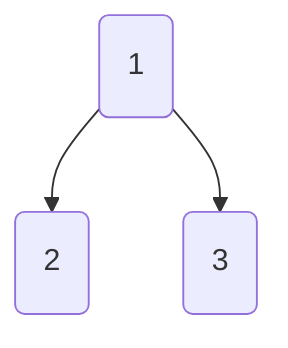

<script type="text/javascript" src="http://cdn.mathjax.org/mathjax/latest/MathJax.js?config=default"></script>

# 数据结构

## 进制运算

### 位运算

| 符号  | 描述  | 运算规则                                                            |
| --- | --- | --------------------------------------------------------------- |
| &   | 与   | 两个位都为1时，结果才为1                                                   |
| \|  | 或   | 两个位都为0时，结果才为0                                                   |
| ^   | 异或  | 两个位相同为0，相异为1                                                    |
| ~   | 取反  | 0变1，1变0                                                         |
| <<  | 左移  | 各二进位全部左移若干位，高位丢弃，低位补0                                           |
| >>  | 右移  | 各二进位全部右移若干位，对无符号数，高位补0，有符号数，各编译器处理方法不一样，有的补符号位（算术右移），有的补0（逻辑右移） |

<!-- more -->

## 链表

### 返回链表的的倒数第n个节点

使用双指针 p1,p2

1. p2遍历链表长度 length，p1遍历到length-n 处

### 跳表

比较准确地说, 跳表是对链表的改进 

调表在有序链表基础上引入了``分层``的概念 

- 跳表的每一层都是一个有序链表

- 特别地，最底层是初始的有序链表。每个位于第 i 层的节点有p 的概率出现在第i+1层， p 为常数。

- 
  
    在跳表中查找，就是从第 层开始，水平地逐个比较直至当前节点的下一个节点大于等于目标节点，然后移动至下一层。重复这个过程直至到达第一层且无法继续进行操作。此时，若下一个节点是目标节点，则成功查找；反之，则元素不存在。这样一来，查找的过程中会跳过一些没有必要的比较，所以相比于有序链表的查询，跳表的查询更快。可以证明，跳表查询的平均复杂度为 O(log n)。

简单来说就是多层链表，最底层为原始存储所有数据的链表，而最顶层则为由链表中的某一节点按顺序构成

达到查找节点的缩短时间

参考下图  [参考自](https://www.debugger.wiki/article/html/1607050845554766)


#### 复杂度

**空间复杂度 **

​    

**时间复杂度**

[参考](https://oi-wiki.org/ds/skiplist/#_4)

## 队列

### 优先队列

> 最大优先队列，无论入队顺序，当前最大的元素优先出队。
> 
> 最小优先队列，无论入队顺序，当前最小的元素优先出队。

使用了二叉堆结构，使得优先优先元素上浮

二叉堆本质上是一种完全二叉树 ，分为两个类型 

> 最大堆: 任何一个父节点的值，都大于等于它左右孩子节点的值
> 
> 最小堆：任何一个父节点的值，等小于等于它左右孩子节点的值

插入节点， 删除节点， 构建二叉堆。 堆的自我调整

以最小堆为例

1. 插入节点 ，插入节点是完全二叉树的最后一个位置 

插入0 ，节点0和其父节点5作比较，0小于5，则让新节点上浮，最终上浮堆顶、

2. 删除节点，删除处于堆顶的节点
   最后一个节点补到原本堆顶位置， 然后比较查看是否需要下沉，

3. 构建二叉堆，本质上是让 **所有非叶子节点依次下沉**

#### 堆的代码实现

> 二叉堆虽然是一颗完全二叉树，但它的存储方式并不是链式存储，而是顺序存储， 二叉堆的所有节点都存储在数组中。


依靠数组下标定位到父节点的孩子节点 

父节点下标：parent 

左孩子下标：2*parent+1 

有孩子下标：2*parent+2

#### 堆排序

1. 把无序数组构建二叉堆 

2. 循环删除堆顶元素，移到集合尾部，调节堆产生新的堆顶 

第一步，把无序数组构建成二叉堆，需要进行n/2次循环。每次循环调用一次 downAdjust 方法，所以第一步的计算规模是  n/2 * logn，时间复杂度 O（nlogn）。

第二步，需要进行n-1次循环。每次循环调用一次 downAdjust 方法，所以第二步的计算规模是 （n-1） * logn ，时间复杂度 O（nlogn）

两个步骤是并列关系，所以整体的时间复杂度同样是 O（nlogn）。

空间复杂度：O(1)

时间复杂度：O(nlog n)

二叉堆的节点下沉调整（downAdjust) 是堆排序算法的基础，假设二叉堆总共有n个元素，那么下沉调整的最坏时间复杂度就等同于二叉堆的高度，也就是O(log n)

**宏观上** 堆排序和快速排序平均时间复杂度都是O(nlog n) ，并且都是[不稳定排序]

    不同点：快速排序的最坏时间复杂度是O(n^2), 而堆排序最坏时间复杂度稳定在O(nlog n ) 快速排序的递归和非递归方法空间复杂度都是O(n)， 而堆排序的空间复杂度是O(1)

### 双端队列

可以从前面进后面出

## 二叉树

多数算法以树结构为框架 

二叉树就是每个节点可以分出两个叉的树 

例如: 



  上图 2,3是 1 的子节点

### 二叉树遍历框架

```
void BST(TreeNode root, int target) {
    if (root.val == target)
        // 找到目标，做点什么
    if (root.val < target) 
        BST(root.right, target);
    if (root.val > target)
        BST(root.left, target);
}
```

leet.652 寻找重复子树


```
List<TreeNode> findDuplicateSubtrees(TreeNode root);
```

分析 : 

想知道以自己为根的子树是不是重复的, 是否应该加入结果列表中, 需要知道一下信息

1. 以我为根的这颗二叉树(子树)样子
2. 以其他节点为根的子树都长什么样子 

计算一颗二叉树有多少个节点

```
int count(TreeNode root){
    if(root == null){
        return 0;
    }
    //先算出右子树有多少节点
    int left = count(root.left);
    int right = count(root.right);

}
```

### 二叉搜索树

#### BST

二叉查找树  ,左节点比父节点值小,  右节点比父节点值大, 高度决定了查找效率

在理想的情况下，二叉查找树增删查改的时间复杂度为O(logN)（其中N为节点数），最坏的情况下为O(N)。当它的高度为logN+1时，我们就说二叉查找树是平衡的。


##### BST查找操作

```
T  key = a search key
Node root = point to the root of a BST

while(true){
    if(root==null){
        break;
    }
    if(root.value.equals(key)){
        return root;
    }
    else if(key.compareTo(root.value)<0){
        root = root.left;
    }
    else{
        root = root.right;
    }
}
return null;
```

注意: 父结点要和左子树所有所属节点进行比较 , 且所有左子树所属节点小于父节点值

进行查找时和父节点比较后可以同时排除两个 key>root , key在root.right 找, key<root , 在 roo.left找

直到当前节点指针为空或者查找到对应的节点，程序查找结束。

##### BST 插入

```
Node node = create a new node with specify value
Node root = point the root node of a BST
Node parent = null;

//find the parent node to append the new node
while(true){
   if(root==null)break;
   parent = root;
   if(node.value.compareTo(root.value)<=0){
      root = root.left;  
   }else{
      root = root.right;
   } 
}
if(parent!=null){
   if(node.value.compareTo(parent.value)<=0){//append to left
      parent.left = node;
   }else{//append to right
      parent.right = node;
   }
}
```

插入操作先通过循环查找到待插入的节点的父节点，和查找父节点的逻辑一样，都是比大小，小的往左，大的往右。找到父节点后，对比父节点，小的就插入到父节点的左节点，大就插入到父节点的右节点上。

##### BST删除

1. 查找到要删除的节点。
2. 如果待删除的节点是叶子节点，则直接删除。
3. 如果待删除的节点不是叶子节点，则先找到待删除节点的中序遍历的后继节点，用该后继节点的值替换待删除的节点的值，然后删除后继节点。


删除叶子节点后需要保证BST树的完整, 所以需要查看节点子节点是否为空 ,不为空要使用子节点替代被删除节点 

##### BST存在的问题

**BST存在的主要问题是，数在插入的时候会导致树倾斜，不同的插入顺序会导致树的高度不一样，而树的高度直接的影响了树的查找效率。理想的高度是logN，最坏的情况是所有的节点都在一条斜线上，这样的树的高度为N。**

#### RBTree

基于BST存在的问题，一种新的树——平衡二叉查找树(Balanced BST)产生了。平衡树在插入和删除的时候，会通过旋转操作将高度保持在logN。其中两款具有代表性的平衡树分别为AVL树和红黑树。AVL树由于实现比较复杂，而且插入和删除性能差，在实际环境下的应用不如红黑树。

红黑树（Red-Black Tree，以下简称RBTree）的实际应用非常广泛，比如Linux内核中的完全公平调度器、高精度计时器、ext3文件系统等等，各种语言的函数库如Java的TreeMap和TreeSet，C++ STL的map、multimap、multiset等。

RBTree也是函数式语言中最常用的持久数据结构之一，在计算几何中也有重要作用。值得一提的是，Java 8中HashMap的实现也因为用RBTree取代链表，性能有所提升

### TreeMap

还有一种`Map`，它在内部会对Key进行排序，这种`Map`就是`SortedMap`。注意到`SortedMap`是接口，它的实现类是`TreeMap`。

```ascii
       ┌───┐
       │Map│
       └───┘
         ▲
    ┌────┴─────┐
    │          │
┌───────┐ ┌─────────┐
│HashMap│ │SortedMap│
└───────┘ └─────────┘
               ▲
               │
          ┌─────────┐
          │ TreeMap │
          └─────────┘
```

`SortedMap`保证遍历时以Key的顺序来进行排序。例如，放入的Key是`"apple"`、`"pear"`、`"orange"`，遍历的顺序一定是`"apple"`、`"orange"`、`"pear"`，因为`String`默认按字母排序：

使用`TreeMap`时，放入的Key必须实现`Comparable`接口。`String`、`Integer`这些类已经实现了`Comparable`接口，因此可以直接作为Key使用。作为Value的对象则没有任何要求。

如果作为Key的class没有实现`Comparable`接口，那么，必须在创建`TreeMap`时同时指定一个自定义排序算法：

### 红黑树

[参考](https://tech.meituan.com/2016/12/02/redblack-tree.html)

红黑树是平衡二叉查找树的一种 

#### 定义

1. 任何一个节点都有颜色 ,黑色或者红色
2. 根节点是黑色的
3. 父子节点之间不能出现两个连续的红节点
4. 任何一个节点向下遍历到其子孙的叶子节点, 所经过的黑节点个数必须相等
5. 空节点被认为是黑色的

```
class Node<T>{
    public T value;
    public boolean isRead;
    public Node<T> left;
    public Node<T> right;

}
```

RBTree 在理论上还是一颗BST树, 但是它在对BST 的插入和删除操作会维持树的平衡, 即保证树的高度在[logN, logN +1 ] (理论上, 极端的情况下可以出现RBTree的高度可以达到2*logN ,但实际上很难遇到 ) . 这样RBTree 的查找时间复杂度始终保持在 O(logN) 从而接近于理想的BST, RBTree 的删除和插入的时间复杂度也是O(logN). RBTree 的查找操作就是BST的查找操作 


#### 查找操作

RBTree 的查找操作和 BST 的查找操作是一样的  

#### 插入操作

插入与BST插入方式一致. 只不过是插入过后, 可能会导致树的不平衡操作 ,只不过插入后会导致树的不平衡 , 需要对数进行旋转操作和颜色修复,使得它符合RBTree的定义 ,新插入的节点是红色的. 颜色修复操作如果遇到父节点的颜色为黑则修复操作结束 , 也就是说 ,只有子父节点为红色节点的时候需要颜色修复操作

颜色修复操作分一下三种情况 

1. 叔叔节点也为红色
2. 叔叔节点为空, 且祖父节点, 父节点和新节点处于一条xie线上
3. 叔叔节点为空, 且祖父节点, 父节点和新节点不处于一条斜线上

插入操作-Case 1

case 1 的操作是将父节点和叔叔节点与祖父节点的颜色互换, 这样就符合了RBTree 的定义 . 即维持了高度的平衡, 修复后颜色也符合RBTree 定义的第三条和第四条 

操作完成后A节点变成了新的节点. 如果 A节点的父节点不是黑色的话, 则继续做修复操作 

插入操作-Casse 2 

case2 的操作是将B节点进行右旋操作, 并且和父节点A互换颜色 . 通过该修复操作RBTree 的高度和颜色都符和红黑树的定义 . 如果 B和 C节点都是右节点的话, 只要将操作变成左旋就可以了

插入操作-Case 3

case 3 的操作是将C节点进行左旋, 这样就从Case 3转换成case 2 了,然后针对case 2 进行操作处理就行了. case 2 操作做了一个右旋操作和颜色互换来达到目的. 如果树的结构是下面的镜像结构, 则只需要将对应的左旋变成右旋, 右旋变成左旋即可 


## 哈希

No.705

不使用任何内建的哈希表库设计一个哈希集合（HashSet）。

实现 MyHashSet 类：

1. void add(key) 向哈希集合中插入值 key 。
2. bool contains(key) 返回哈希集合中是否存在这个值 key 。
3. void remove(key) 将给定值 key 从哈希集合中删除。如果哈希集合中没有这个值，什么也不做。

哈希集合实现

```java
class MyHashSet {
    boolean[] nodes = new boolean[1000009];

    public void add(int key) {
        nodes[key] = true;
    }

    public void remove(int key) {
        nodes[key] = false;
    }

    public boolean contains(int key) {
        return nodes[key];
    }
}
```

引申一下哈希函数

哈希函数是指把一个大范围映射到一个小范围, 把大范围映射到一个小范围的目的往往是为了节省空间，使得数据容易保存。

\1. Hash的主要原理就是把大范围映射到小范围；所以，你输入的实际值的个数必须和小范围相当或者比它更小。不然冲突就会很多。
\2. 由于Hash逼近单向函数；所以，你可以用它来对数据进行加密。
\3. 不同的应用对Hash函数有着不同的要求；比如，用于加密的Hash函数主要考虑它和单项函数的差距，而用于查找的Hash函数主要考虑它映射到小范围的冲突率。

Hash函数应用的主要对象是数组（比如，字符串），而其目标一般是一个int类型。以下我们都按照这种方式来说明。

一般的说，Hash函数可以划分为如下几类：
\1. 加法Hash

\2. 位运算Hash

\3. 乘法Hash

\4. 除法Hash

\5. 查表Hash

\6. 混合Hash

7.数组Hash

## 贪心算法

 所谓贪心算法是指，在对问题求解时，总是做出在当前看来是最好的选择。也就是说，不从整体最优上加以考虑，他所做出的仅是在某种意义上的局部最优解。

   贪心算法没有固定的算法框架，算法设计的关键是贪心策略的选择。必须注意的是，贪心算法不是对所有问题都能得到整体最优解，选择的贪心策略必须具备无后效性，即某个状态以后的过程不会影响以前的状态，只与当前状态有关。

  **所以对所采用的贪心策略一定要仔细分析其是否满足无后效性。**

思路

1.建立数学模型来描述问题。

  2.把求解的问题分成若干个子问题。

  3.对每一子问题求解，得到子问题的局部最优解。

  4.把子问题的解局部最优解合成原来解问题的一个解。

贪心算法适用情况很少 

从问题的某一初始解出发；

  while （能朝给定总目标前进一步）

  { 

​     利用可行的决策，求出可行解的一个解元素；

  }

  由所有解元素组合成问题的一个可行解；

### OfferNo14   剪绳子问题

```java
public int adjectime(int length){
        if(length<2){
            return 0;
        }
        if(length<4){
            return  length-1;
        }
        // n>=5 时. 多剪长度为 3 的绳子 , 剩下的绳子长度为4时, 把僧子剪成两段长度为2的绳子
        int timesOf3 = length / 3 ;
        if (length%3 == 1 ){
            --timesOf3;
        }
        int timeof2 = (length - timesOf3 * 3 ) >> 1;
        return (int) (Math.pow(3,timesOf3)*Math.pow(2,timeof2));
    }
```

## 动态规划

### 基础

动态规划应用于子问题重叠的情况：

1. 要去刻画最优解的结构特征；
2. 尝试递归地定义最优解的值（就是我们常说的考虑从 转移到 ）；
3. 计算最优解；
4. 利用计算出的信息构造一个最优解。

[分治] 是算法中的一个基本思想,通过将原问题分解为子问题,不断递归地将子问题分解为更小的子问题, 并通过组合子问题的解来得到原问题的解 

### 思路问题

将问题分解为一个个子状态 ,将前一个状态和后一个状态关联起来, 找到 状态函数 

[动态规划] 也通过组合子问题的解来得到原问题的解 . 不同的是, 适合用动态规划的问题具有 [重叠子问题] 和 [最优子结构] 两大特性 

#### 重叠子问题

动态规划的子问题是有重叠的，即各个子问题中包含重复的更小子问题。若使用暴力法穷举，求解这些相同子问题会产生大量的重复计算，效率低下。

动态规划在第一次求解某子问题时，会将子问题的解保存至矩阵中；后续遇到重叠子问题时，则直接通过查表获取解，保证每个**独立子问题只被计算一次**，从而降低算法的时间复杂度。

#### 最优子结构

如果一个问题的最优解可以由其子问题的最优解组合构成，那么称此问题具有最优子结构。

动态规划从基础问题的解开始，不断迭代组合、选择子问题的最优解，最终得到原问题最优解。

具有最优子结构也可能是适合用贪心的方法求解。

注意要确保我们考察了最优解中用到的所有子问题。

1. 证明问题最优解的第一个组成部分是做出一个选择；
2. 对于一个给定问题，在其可能的第一步选择中，你界定已经知道哪种选择才会得到最优解。你现在并不关心这种选择具体是如何得到的，只是假定已经知道了这种选择；
3. 给定可获得的最优解的选择后，确定这次选择会产生哪些子问题，以及如何最好地刻画子问题空间；
4. 证明作为构成原问题最优解的组成部分，每个子问题的解就是它本身的最优解。方法是反证法，考虑加入某个子问题的解不是其自身的最优解，那么就可以从原问题的解中用该子问题的最优解替换掉当前的非最优解，从而得到原问题的一个更优的解，从而与原问题最优解的假设矛盾。

要保持子问题空间尽量简单，只在必要时扩展。

最优子结构的不同体现在两个方面：

1. 原问题的最优解中涉及多少个子问题；
2. 确定最优解使用哪些子问题时，需要考察多少种选择。

子问题图中每个定点对应一个子问题，而需要考察的选择对应关联至子问题顶点的边。

**经典问题：**

- **无权最短路径：** 具有最优子结构性质。
- **无权最长（简单）路径：** 此问题不具有，是 NPC 的。区别在于，要保证子问题无关，即同一个原问题的一个子问题的解不影响另一个子问题的解。相关：求解一个子问题时用到了某些资源，导致这些资源在求解其他子问题时不可用。

##### 示例: 蛋糕最高售价

小力开了一家蛋糕店，并针对不同重量的蛋糕设定了不同售价，分别为：

| 蛋糕重量 | 0   | 1   | 2   | 3   | 4   | 5   | 6   |
|:----:|:---:|:---:|:---:|:---:|:---:|:---:|:---:|
| 售价   | 0   | 2   | 3   | 6   | 7   | 11  | 15  |

问题 :现给定一个重量为n的蛋糕, 问小力如何切蛋糕可以达到蛋糕最高总售价 

- 对于本题: 重量为 n的蛋糕的总售价可切分为n种组合,  重量为0,1,2,3,...,n-1 蛋糕最高售价加上n,
  n-1, n-2 ,..., 1剩余重量蛋糕的售价; 从这些组合中, 售价最高的组合便是原问题的解f(n),这便是题的最优子结构

寻找状态转移方程 
$$
f(n)=\max_{0<=i<n} (f(i)+p(n-i))
$$
**实现代码**

```java
int maxCakePrice(int n,int[]priceList){
    if(n<=1) return priceList[n];
    int []dp=new int[n+1];
    //双重循环为了保证dp[j]每一个子问题都是最优解,也可以用递归
    for(int j=1;j<=n;j++){
        //i<j 保证分的蛋糕重量不会超过给定值 ,
        for(int i=0;i<j;i++){
            dp[j]=Math.max(dp[j],dp[i]+priceList[j-i]);
        }
    }
    return dp[n];
}
```

- 返回值: 需求重量为 n 的蛋糕最高售价为dp[n]  

这种题型可以转化为目标值分解求最大和 

#### 实现方法

- 带备忘录的自顶向下法(记忆化搜索)

- 自底向上法(将问题按规模排序,类似于递推 )

### 解决套路

明白套路和选择

```
for 状态1 in 状态1的所有取值：
    for 状态2 in 状态2的所有取值：
        for ...
            dp[状态1][状态2][...] = 择优(选择1，选择2...)
```

### KMP字符匹配算法

Knuth-Morris-Pratt 算法,  是一个著名的字符串匹配算法 ,效率很高

KMP **永不回退 `txt` 的指针 `i`，不走回头路（不会重复扫描 `txt`），** 借助 dp 数组中存储的信息 把 pat 移到正确的位置和 txt 匹配 

dp数组记录状态   `dp[j][c]`= next

```
 0<= j < M，代表当前的状态
 0 <= c < 256，代表遇到的字符（ASCII 码）
 0 <= next <= M，代表下一个状态
```

```java
public  class KMP{
    private int [][]dp;
    private String pat;

    public KMP(String pat){
        this.pat = pat;
        //通过pat 构建dp数组
        //需要O(M)时间
    }
    public int search(String txt){
        //借助dp数组去匹配 txt 
        //需要 O(N)时间 
    }
}
```

 当我们需要用同一 pat 去匹配不同 txt 时, 就不需要浪费时间 构造 dp数组了 

```java
KMP kmp = new KMP("aaab");
int pos1 = kmp.search("aaacaaaab");
int pos2 = kmp.search("aaaaaaaab");
```

#### 状态机概述

为什么说 KMP 算法和状态机有关呢？是这样的，我们可以认为 `pat` 的匹配就是状态的转移。比如当 pat = "ABABC"：


如上图，圆圈内的数字就是状态，状态 0 是起始状态，状态 5（`pat.length`）是终止状态。开始匹配时 `pat` 处于起始状态，一旦转移到终止状态，就说明在 `txt` 中找到了 `pat`。比如说当前处于状态 2，就说明字符 "AB" 被匹配：


另外，处于不同状态时，`pat` 状态转移的行为也不同。比如说假设现在匹配到了状态 4，如果遇到字符 A 就应该转移到状态 3，遇到字符 C 就应该转移到状态 5，如果遇到字符 B 就应该转移到状态 0：

[](https://github.com/labuladong/fucking-algorithm/blob/master/pictures/kmp/state4.jpg)

具体什么意思呢，我们来一个个举例看看。用变量 `j` 表示指向当前状态的指针，当前 `pat` 匹配到了状态 4：

[](https://github.com/labuladong/fucking-algorithm/blob/master/pictures/kmp/exp1.jpg)

如果遇到了字符 "A"，根据箭头指示，转移到状态 3 是最聪明的：

[](https://github.com/labuladong/fucking-algorithm/blob/master/pictures/kmp/exp3.jpg)

如果遇到了字符 "B"，根据箭头指示，只能转移到状态 0（一夜回到解放前）：

[](https://github.com/labuladong/fucking-algorithm/blob/master/pictures/kmp/exp5.jpg)

如果遇到了字符 "C"，根据箭头指示，应该转移到终止状态 5，这也就意味着匹配完成：

[](https://github.com/labuladong/fucking-algorithm/blob/master/pictures/kmp/exp7.jpg)

当然了，还可能遇到其他字符，比如 Z，但是显然应该转移到起始状态 0，因为 `pat` 中根本都没有字符 Z：

[](https://github.com/labuladong/fucking-algorithm/blob/master/pictures/kmp/z.jpg)

这里为了清晰起见，我们画状态图时就把其他字符转移到状态 0 的箭头省略，只画 `pat` 中出现的字符的状态转移：

[](https://github.com/labuladong/fucking-algorithm/blob/master/pictures/kmp/allstate.jpg)

KMP 算法最关键的步骤就是构造这个状态转移图。**要确定状态转移的行为，得明确两个变量，一个是当前的匹配状态，另一个是遇到的字符**；确定了这两个变量后，就可以知道这个情况下应该转移到哪个状态。

下面看一下 KMP 算法根据这幅状态转移图匹配字符串 `txt` 的过程：

[](https://github.com/labuladong/fucking-algorithm/blob/master/pictures/kmp/kmp.gif)

**请记住这个 GIF 的匹配过程，这就是 KMP 算法的核心逻辑**！

为了描述状态转移图, 定义一个二维dp数组, 含义如下:

```
dp[j][c] = next 
0 <= j < M 代表当前状态 
0 <= c < 256 代表遇到的字符(ASCII码)
0 <= next <= M , 代表下一个状态 

dp[4]['A'] = 3 表示 :
当前是状态 4 , 如果遇到字符 A  pat 应该转移到状态3 

dp[1]['B'] = 2 表示 :
当前状态是1 , 如果遇到字符 B, pat 应该转移到状态 2
```

根据dp数组定义和状态转移过程  可以写出KMP算法的search 函数代码:

```java
public int search(String txt){
    int M = pat.length();
    int N = txt.length();
    //pat的初始态 为 0 
    int j = 0;
    for(int i = 0; i < N; i++){
        // 当前是状态 j, 遇到字符 txt[i] , 
        // pat 应该转移到那个状态 
        j=dp[j][txt.charAt(i)];
        //如果达到终止态, 返回匹配开头的索引
        if(j==M)return i - M + 1;
    }
    //没达到终止态, 匹配失败 
     return -1;
}
```

#### 构建状态转移图

确定状态的行为, 必须明确两个变量, 一是当前的匹配状态, 另一个是遇到的字符, 而且我们已经根据这个逻辑确定了dp数组的含义, 那么构造dp 数组的框架为:

```
for 0<=j<M: #状态 
    for 0 <= c < 256: #字符
        dp[j][c] = next 
```

求next 状态 , 遇到字符c和pat[j]匹配的话, 状态应该向前推进一个, 也就是说 next = j + 1 ,不妨称这种情况为状态推进:


如果遇到字符c 和 pat[j] 不匹配的话, 状态就要回退(或者原地不动), 可称这种情况为状态重启: 


如何得知在哪个状态重启呢? 再定义一个名字: 影子状态 , 用变量X 表示 . **所谓影子状态，就是和当前状态具有相同的前缀**。比如下面这种情况：

当前状态 j=4, 影子状态为 X=2, 都有相同的前缀 "AB".因为状态`X`和状态`j`存在相同的前缀，所以当状态`j`准备进行状态重启的时候（遇到的字符`c`和`pat[j]`不匹配），可以通过`X`的状态转移图来获得**最近的重启位置**。

比如上面的情况 ,状态 j遇到一个字符"A", 因该转移到哪里? 首先状态4只有遇到"C" 才能推进状态, 遇到"A" 那就智能进行状态重启, 状态j会把这个字符委托给状态X处理, 也就是dp[ j ] [ 'A' ] = dp[ X ] [ 'A' ] : 


这样做的原因: 既然 j 这边确定字符 "A" 无法推进状态, 只能回退, 而且KMP 算法就是要尽可能少的回退, 以免多余的计算, 那么 j 就可以去问问和自己具有相同前缀的 X ,如果X 遇见"A" 可以进行状态推进, 那就转移过去, 因为这样回退的最少: 


​    当然, 如果遇到的字符是"B" , 状态X也不能进行状态 推进, 只能回退, j 只要跟着X 指引的方向回退就行了


动态规划算法就是利用过去的结果解决现在的问题 

细化一下刚才的框架代码: 

```
int X #影子状态 
for 0<=j < M:
    for 0 <= c <256: 
        if c==pat[j]:
             #状态推进 
             dp[j][c] = j + 1
        else: 
            #状态重启
            #委托 X 计算重启位置
            dp[j][c]=dp[X][c]
```

#### 代码实现

最后一个问题: 影子状态 X是如何获得的呢 

```java
public clas KMP{

    private int[][] dp;
    private String pat; 

    public KMP(String pat){
        this.pat = pat;
        int M = pat.length();
        //dp[状态][字符] = 下个状态 
        dp = new int[M][256];
        //base case 
        dp[0][pat.charAt[0]] = 1; 
        //影子状态X初始为 0 
        int X = 0;
        //当前状态j 从 1 开始 
        for(int j = 1; j < M;j++){
            for(int c = 0; c < 256 ; c++){
                if(pat.charAt(j)==c)
                    dp[j][c] = j + 1;
                else 
                    dp[j][c] = dp[X][c];
            }
            //更新影子状态 
            X = dp[X][pat.charAt[j]];
        }
    }

    public int search(String txt){ return 0 ;}
}
```

```java
//base case 
dp[0][pat.charAt[0]] = 1; 
```

这行代码是 base case , 只有遇到 pat[0] 这个字符才能使状态从0 转移到 1 , 遇到其它字符的话还是停留在状态 0 ( Java 默认初始化数组为 0 )

影子状态 X 是 先初始化为 0 , 然后随着j 的前进而不断跟新的 .  

如何更新状态X :

```
int X = 0 ;
for( int j = 1; j < M ; j++){
    //更新影子状态 
    //当前是状态 X, 遇到字符pat[j], 
    //pat 应该转移到哪个状态? 
    X = dp[X][pat.charAt(j)];
}
```

```
int j = 0;
for(int i = 0; i < N ; i++){
    //当前是状态 j, 遇到字符 txt[i],
    //pat 应该转移到哪个状态? 
    j = dp[j][txt.charAt(i)];
}
```

注意 for 循环中的变量初始值  

后者在txt中匹配 pat, 前者在 pat 中匹配 pat[1:]. 状态 X 总是落后状态j 一个状态 , 与 j 具有最长的相同前缀 , 所以我们把X比喻为影子状态 

另外, 构建dp 数组是根据base case dp[0] [..] 向后推演. 

下面来看一下状态转移图的完整构造过程, 


KMP完整代码 : 

```
public class KMP{
    private int[][]dp;
    private String pat;

    public KMP(String pat){
        this.pat = pat;
        int M = pat.length();
        //dp[状态][字符] = 下个撞他 
        dp = new int[M][256];
        //base case 
        dp[0][pat.charAt(0)] = 1;
        //影子状态 
        int X = 0;
        // 构建状态转移图 
        for(int j=1;j<M;j++){
            for(int c = 0;j < 256; c++){
                dp[j][c] = dp[X][c];
            dp[j][pat.charAt(j)] = j+1;
            //影子状态 
            X =  dp[X][pat.charAt(j)];     
            }
        }
    }
    public int search(String txt){
        int M = pat.length();
        int N = txt.length();
        //pat的初始状态为 0  
        int j = 0;
        for(int i = 0 ;i<N; i++){
            //计算pat 的下一个状态 
            j = dp[j][txt.charAt(i)];
            //达到终止态, 返回结果
            if(j==M) reutrn i - M + 1;
        }
    //没达到终止态 
    return -1;
    }
}
```

#### 总结

传统的KMP 算法是使用一个一维数组 next 记录前缀信息, 而本文是使用一个二维数组 dp 以状态转移的角度解决字符匹配问题, 单身空间复杂度仍然是 O(256M) = O(M) 

在pat 匹配 txt的过程中, 只要明确了[当前处在哪个状态] 和 [ 遇到的字符是什么 ] 这两个问题, 就可以确定应该转移到哪个状态(推进或回退) 

对于一个模式串 pat, 其总共就有M 个状态, 对于 ASCII 字符, 总共不会超过256 种. 所以我们就构造一个数组 dp[M] [256] 来包含所有情况, 并且明确 dp 数组的含义 : 

 dp[ j ]  [c] = next 表示, 当前是状态 j, 遇到了字符 c, 应该转移到状态 next . 

明确了其含义, 就可以很容易写出 search 函数的代码 

对于如何构建这个dp 数组, 需要一个辅助状态 X , 它永远比当前状态 j 落后一个状态 ,拥有和 j 最长的相同前缀 ,给它起了个名字交 [影子状态 ] 

在构建当前状态`j`的转移方向时，只有字符`pat[j]`才能使状态推进（`dp[j][pat[j]] = j+1`）；而对于其他字符只能进行状态回退，应该去请教影子状态`X`应该回退到哪里（`dp[j][other] = dp[X][other]`，其中`other`是除了`pat[j]`之外所有字符）。

对于影子状态`X`，我们把它初始化为 0，并且随着`j`的前进进行更新，更新的方式和 search 过程更新`j`的过程非常相似（`X = dp[X][pat[j]]`）。

KMP 算法也就是动态规划的思路，我们的公众号文章目录有动态规划系列，而且都是按照一套框架来的，无非就是描述问题逻辑，明确`dp`数组含义，定义 base case 

### 最长递增子序列


子串一定是连续的,子序列不一定是连续的

#### 动态归纳解法

动态规划的核心设计思想是数学归纳法 

假设一个结论在 k<n时成立,再证明k=n时成立, 当证明成立时,则说明这个结论对于k等于任何数都成立 

设计动态规划算法, 我们需要一个dp数组, 可以假设dp[0...i-1] 都已经被算出来了, 然后怎么通过这些结果算出dp[i]

dp[i] 表示以 nums[i] 这个数结尾的最长递增**子序列**的长度。


算法演进过程:


根据此定义,我们的最终结果(子序列的最大长度) 应该是dp 数组的最大值 

```
int res = 0;
for(int i=0;i<dp.length();i++){
    res = Math.max(res,dp[i]);
}
return res;
```

设计算法逻辑来正确计算dp[i]

推出dp[5]

递增子序列, 找出前面比nums[5] 值小的子序列,将nums[5]接到最后, 就可以形成一个新的递增子序列, 新的子序列长度加1 ,

可能会生成很多新的子序列, 但我们只要最长的子序列的长度作为dp[5]的值 

如

```
for(int j=0;j<i;j++){
    if(nums[j]<nums[i]){
        dp[i] = Math.max(dp[i],dp[j]+1);
    }
}
```

计算任意dp[i]


一个细节问题,  base case , dp 数组应该初始化为 1 , 因为子序列最少也要包含自己, 所以长度最小为1,

完整代码: 

```java
public int lengthOfLTS(int []nums){
    int[]dp=new int[num.length()];
    //dp 数组全都初始化为 1 
    Arrays.fill(dp,1);
    for(int i=0;i<nums.length();i++ ){
        for(int j=0;j<i;j++){
            if(nums[j]<nums[i])
                dp[i]=Math.max(dp[i],dp[j]+1);
        }
    }
    int res = 0;
    for(int i=0;i<dp.length();i++){
        res-Math.max(res,dp[i]);
    }
    return res;
}
```

时间复杂度 O(N^2)  ,动态规划设计流程  

- 明确dp数组所存数据的含义(5*) ,不得当或不够清晰, 会阻碍之后的步骤 
- 根据dp数组的定义, 运用数学归纳法的思想, 假设dp[0...i-1] 都已知, 想办法求出dp[i], 这步完成 ,整个题目基本就解决了 
- 无法完成上一步时,可能是dp数组的定义不够恰当,需要重新定义dp数组的含义 ; 或者可能是dp数组促成农户的信息还不够, 不足以推出下一步的答案 , 需要把dp数组扩大成二维数组甚至三维数组

#### 二分查找

时间复杂度会将为O(NlogN) ,作为 了解 


二分查找, 对本题来说二分查找难想, 有动态规划就足够, 但二分查找还是要学 

  

### 状态压缩

对动态规划进行降维打击

[参考](https://mp.weixin.qq.com/s?__biz=MzAxODQxMDM0Mw==&mid=2247485824&idx=1&sn=09caa56172729cf8cf1b53089e8dee55&chksm=9bd7f788aca07e9e4149f384ec5e279adadec75a2828a76066c56b4789209fb1cd54f9e63f9d&scene=21#wechat_redirect)

状态压缩就是投影

### 股票买卖问题

参考题目, 共性题目 


状态穷举


这个问题的[状态] 有三个, ，第一个是天数，第二个是当天允许交易的最大次数，第三个是当前的持有状态（即之前说的 rest 的状态，我们不妨用 1 表示持有，0 表示没有持有)

可以使用三维数组dp 装下这几种状态的全部组合, for 循环就能完成穷举 


状态转移方程框架


#### k=2  时

```
原始的动态转移方程, 没有可化简的地方
dp[i][k][0] = max(dp[i-1][k][0], dp[i-1][k][1]+prices[i])
dp[i][k][i] = max(dp[i-1][k][1], dp[i-1][k-1][0] - prices[i])
```

因为没有消掉K的影响, 所以必须要用for 循环对 k进行穷举才是正确的


```
int max_k=2;
int [][] dp = new int[n][max_k + 1][2];
for(int i=0;i<n;i++){
    for(int k = max_k; k>=1;k--){
        if(i-1=-1) { /*处理base case */}
        dp[i][k][0] = max(dp[i-1][k][0], dp[i-1][k][1] + prices[i]);
        dp[i][k][1] = max(dp[i-1][k][1], dp[i-1][k-1][0]- prices[i]);
    }
}
//穷举了 n x max_k x 2个状态 ,正确
return dp[n-1][max_k][0];
```

第二种解法：因为这里 k 取值范围比较小，所以也可以不用 for 循环，直接把 k = 1 和 2 的情况手动列举出来也是一样的：


有状态转移方程和含义明确的变量名引导，相信你很容易看懂。如我我们想故弄玄虚，可以把上述四个变量换成 a, b, c, d。这样当别人看到你的解法时就会大惊失色，一头雾水，不得不对你肃然起敬。(作者爱装逼, 不是我说的.我没有这样的想法, 顶多换成 wsdl )

### 0，1 背包

有 n个物品和一个容量为的背包，每个物品有重量$W_i $和价值$V_i$两种属性，要求选若干物品放入背包使背包中物品的总价值最大且背包中物品的总重量不超过背包的容量。

在上述例题中，由于每个物体只有两种可能的状态（取与不取），对应二进制中的 和 ，这类问题便被称为「0-1 背包问题」

例题中已知条件有第$W_i$个物品的重量 ，价值 $v_i$，以及背包的总容量 。设 DP 状态 为在只能放前 个物品的情况下，容量为 的背包所能达到的最大总价值。

最后可以得到状态转移方程:    $f_i = max(f_i,f_j-w+v_i)$

核心代码

```
for(int i=1;i<==n;i++){
    for(int l=W;l>=w[i];l--){
        f[l]=max(f[l],f[l-w[i]]+v[i]);
    }
}
return f[W];
```

### 完全背包

[参考](https://blog.csdn.net/wumuzi520/article/details/7014830)

在0-1背包基础上延伸 ,  物品可以重复装

## B树

B树也称B-树,它是一颗**多路平衡查找树**。二叉树我想大家都不陌生，其实，B树和后面讲到的B+树也是从最简单的二叉树变换而来的，并没有什么神秘的地方，下面我们来看看B树的定义。

- 每个节点最多有m-1个**关键字**（可以存有的键值对）。
- 根节点最少可以只有1个**关键字**。
- 非根节点至少有m/2个**关键字**。
- 每个节点中的关键字都按照从小到大的顺序排列，每个关键字的左子树中的所有关键字都小于它，而右子树中的所有关键字都大于它。
- 所有叶子节点都位于同一层，或者说根节点到每个叶子节点的长度都相同。
- 每个节点都存有索引和数据，也就是对应的key和value。

所以，根节点的**关键字**数量范围：`1 <= k <= m-1`，非根节点的**关键字**数量范围：`m/2 <= k <= m-1`。

另外，我们需要注意一个概念，描述一颗B树时需要指定它的阶数，阶数表示了一个节点最多有多少个孩子节点，一般用字母m表示阶数。

我们再举个例子来说明一下上面的概念，比如这里有一个5阶的B树，根节点数量范围：1 <= k <= 4，非根节点数量范围：2 <= k <= 4。

### 插入

插入的时候，我们需要记住一个规则：**判断当前结点key的个数是否小于等于m-1，如果满足，直接插入即可，如果不满足，将节点的中间的key将这个节点分为左右两部分，中间的节点放到父节点中即可。**

例子：在5阶B树中，结点最多有4个key,最少有2个key（注意：下面的节点统一用一个节点表示key和value）。

- 插入18，70，50,40


- 插入22


插入22时，发现这个节点的关键字已经大于4了，所以需要进行分裂，分裂的规则在上面已经讲了，分裂之后，如下。


- 接着插入23，25，39


分裂，得到下面的。


更过的插入的过程就不多介绍了，相信有这个例子你已经知道怎么进行插入操作了。

### 删除

B树的删除操作相对于插入操作是相对复杂一些的，但是，你知道记住几种情况，一样可以很轻松的掌握的。

- 现在有一个初始状态是下面这样的B树，然后进行删除操作。


- 删除15，这种情况是删除叶子节点的元素，如果删除之后，节点数还是大于`m/2`，这种情况只要直接删除即可。


- 接着，我们把22删除，这种情况的规则：22是非叶子节点，**对于非叶子节点的删除，我们需要用后继key（元素）覆盖要删除的key，然后在后继key所在的子支中删除该后继key**。对于删除22，需要将后继元素24移到被删除的22所在的节点。


此时发现26所在的节点只有一个元素，小于2个（m/2），这个节点不符合要求，这时候的规则（向兄弟节点借元素）：**如果删除叶子节点，如果删除元素后元素个数少于（m/2），并且它的兄弟节点的元素大于（m/2），也就是说兄弟节点的元素比最少值m/2还多，将先将父节点的元素移到该节点，然后将兄弟节点的元素再移动到父节点**。这样就满足要求了。

我们看看操作过程就更加明白了。


- 接着删除28，**删除叶子节点**，删除后不满足要求，所以，我们需要考虑向兄弟节点借元素，但是，兄弟节点也没有多的节点（2个），借不了，怎么办呢？如果遇到这种情况，**首先，还是将先将父节点的元素移到该节点，然后，将当前节点及它的兄弟节点中的key合并，形成一个新的节点**。


移动之后，跟兄弟节点合并。


删除就只有上面的几种情况，根据不同的情况进行删除即可。

上面的这些介绍，相信对于B树已经有一定的了解了，接下来的一部分，我们接着讲解B+树，我相信加上B+树的对比，就更加清晰明了了。

## B+树

### 和B树的相同点

- 根节点至少一个元素
- 非根节点元素范围：m/2 <= k <= m-1

### 和B树的不同点

- B+树有两种类型的节点：内部结点（也称索引结点）和叶子结点。内部节点就是非叶子节点，内部节点不存储数据，只存储索引，数据都存储在叶子节点。
- 内部结点中的key都按照从小到大的顺序排列，对于内部结点中的一个key，左树中的所有key都小于它，右子树中的key都大于等于它。叶子结点中的记录也按照key的大小排列。
- 每个叶子结点都存有相邻叶子结点的指针，叶子结点本身依关键字的大小自小而大顺序链接。
- 父节点存有右孩子的第一个元素的索引。

下面我们看一个B+树的例子，感受感受它吧！


### 插入操作

对于插入操作很简单，只需要记住一个技巧即可：**当节点元素数量大于m-1的时候，按中间元素分裂成左右两部分，中间元素分裂到父节点当做索引存储，但是，本身中间元素还是分裂右边这一部分的**。

下面以一颗5阶B+树的插入过程为例，5阶B+树的节点最少2个元素，最多4个元素。

- 插入5，10，15，20


- 插入25，此时元素数量大于4个了，分裂


- 接着插入26，30，继续分裂


### 删除操作

对于删除操作是比B树简单一些的，因为**叶子节点有指针的存在，向兄弟节点借元素时，不需要通过父节点了，而是可以直接通过兄弟节移动即可（前提是兄弟节点的元素大于m/2），然后更新父节点的索引；如果兄弟节点的元素不大于m/2（兄弟节点也没有多余的元素），则将当前节点和兄弟节点合并，并且删除父节点中的key**，下面我们看看具体的实例。

- 初始状态


- 删除10，删除后，不满足要求，发现左边兄弟节点有多余的元素，所以去借元素，最后，修改父节点索引


- 删除元素5，发现不满足要求，并且发现左右兄弟节点都没有多余的元素，所以，可以选择和兄弟节点合并，最后修改父节点索引


- 发现父节点索引也不满足条件，所以，需要做跟上面一步一样的操作


这样，B+树的删除操作也就完成了，是不是看完之后，觉得非常简单！

## 对于B+树和B树总结

B+树相对于B树有一些自己的优势，可以归结为下面几点。

- 单一节点存储的元素更多，使得查询的IO次数更少，所以也就使得它更适合做为数据库MySQL的底层数据结构了。
- 所有的查询都要查找到叶子节点，查询性能是稳定的，而B树，每个节点都可以查找到数据，所以不稳定。
- 所有的叶子节点形成了一个有序链表，更加便于查找。

## 算法

### LRU

缓存淘汰策略 .快来手写LRU算法 

No146 .  

首先要接受一个cpacity 参数 作为缓存的最大容量 , 然后实现两个API ,一个是    put(key, val) 方法存入键值对, 另一个是get(key) 方法获取key 对应的val , 如果key 不存在则返回 -1. 

注意哦, **get**和 **put**  方法是O(1) 的时间复杂度, 我们举个具体例子来看看LRU 算法怎么工作 .

```
/* 缓存容量为 2 */ 
LRUCache cache = new LRUCache(2); 
// 可以把cache 理解成一个队列 
// 假设左边是对头, 右边是队尾
// 最近使用的排在对头, 右边是队尾
// 最近使用的排在对头, 久未使用的排在队尾 .
// 圆括号表示键值对( key, val)

cache.put(1,1)
// cache = [(1,1)]

cache.put(2,2)
// cache = [(2,2), (1,1)]

chche.get(1)          //返回 1
// cache = [(1,1),(2,2)]
// 解释: 因为最近访问了键 1, 所以提前队头 
// 返回键 1 对应的值 1 

cache.put(3,3);
// cache = [(3,3),(1,1)]
// 解释:缓存容量已满, 需要删除内容空出位置 
// 优先删除久未使用的数据, 也就是队尾的数据 
// 然后把新的数据插入队头

cache.get(2) ;         // 返回 -1 (未找到)
// cache = [(3,3),(1,1)]
// 解释 : cache 中不存在键为 2的数据 

cache.put(1,4)
// cache = [(1,4).(3,3)]
// 解释: 键 1已存在, 把原始值覆盖为4 
// 不要忘了也要将键值队提到 队头
```

#### LRU 设计

1. 分析上面操作过程, 要让put和get 方法 时间复杂度为O(1), 我们可以总结出 cache 这个数据结构必要条件 

2. 在cache中快速找某个key是否已存在并得到对应的value

3. 每次访问 cache 中的某个key , 需要将这个元素变为最近使用的, 也就是cache 要支持在任意位置快速插入和删除元素 

结合上面要求 , 形成一种新的数据结构: 哈希链表 : LinkedHashMap

LRU 缓存算法的核心数据结构就是哈希链表, 双向链表和哈希表的结合体 


我们构建 缓存 需要删除操作 ,删除一个节点不光要得到该节点本身的指针, 也需要操作其前驱节点的指针,而双向链表才能支持查找前驱, 保证操作的时间复杂度O(1)

**注意我们实现的双链表只能从尾部插入, 也就是说靠近尾部的数据是最近使用的 , 靠头部的数据是最久未使用的**

有了双向链表的实现, 我们只需要在LRU算法中把它和哈希表结合起来即可 

同时维护一个双链表cache和一个哈希表map , 很容易漏掉一些操作, 比如删除某个key 时 , 在cache 中删除了对应的Node, 但忘记了在map中删除 key 

**在两种数据结构上提供一层抽象API** 

尽量让LUR 的主方法 get 和 put 避免直接操作 map和 cache 的细节 

当我们对元素进行操作时的时候, 我们需要用到key来保证 cache 和 map的一致性 

当缓存容量已满, 我们不仅仅要删除最后一个Node 节点, 还要把map 中映射到该节点的key同时删除, 而这个key 只能由 Node 得到 , 如果 Node 结构中只存储 val , 那么我们就无法得知key 时什么 , 无法删除 map 中的键 , 造成错误

使用函数 对 操作进行简单封装 ,调用这些函数就可以避免直接操作 cache 链表 和 map 哈希表   

```java
package LRU;

/**
 * @author badpoone
 */
public class Node {
    public  int key,val;
    public  Node next, prev;
    public  Node(int k, int v){
        this.key = k ;
        this.val = v ;
    }


}

/******* */
package LRU;

/**
 * @author badpoone
 */
public class DoubleList {
    //头尾虚节点
    private Node head, tail;
    //链表元素数
    private int size;

    public DoubleList(){
        //初始化双向链表数据
        head = new Node(0,0);
        tail = new Node(0,0);
        head.next = tail;
        tail.prev = head;
        size = 0;
    }


    /**
     *    在链表尾部添加节点x, 时间O(1)
     * @param x 被添加节点
     */
    public  void  addLast(Node x){
        //将被插入位置的节点记录为x的记录
        x.prev = tail.prev;
        //将tail 节点变成x的next 节点
        x.next = tail;
        tail.prev.next = x;
        tail.prev = x;
        size ++ ;
    }

    /**
     * 删除链表种 的x节点(x一定存在)
     * @param x
     * 由于是双链表且给的是目标Node节点, 时间 O(1)
     */
    public void remove(Node x){
        //x的前一个节点
        x.prev.next = x.next;
        //x的后一个节点
        x.next.prev = x.prev;
        size--;
    }

    /**
     * 溢出链表中第一个节点, 并返回该节点, 时间O(1)
     * @return 被删除的第一个节点
     */
    public Node removeFirst(){
        if(head.next==null){
            return null;
        }
        Node first = head.next;
        remove(first);
        return  first;
    }

    /**
     *
     * @return 链表长度
     */
    public  int size(){
        return  size;
    }
}
```

#### get

,来实现 LRU 算法的get 方法

```java
public int get(int key) {
    if (!map.containsKey(key)) {
        return -1;
    }
    // 将该数据提升为最近使用的
    makeRecently(key);
    return map.get(key).val;
}
```

#### put

put 方法比较复杂 


```java
 public void  put(int key, int val){
        if(map.containsKey(key)){
            //删除旧的数据
            deleteKey(key);
            //新插入的数据为最近使用的数据
            addRecently(key,val);
        }

        if(cap == cache.size()){
            //删除最久未使用的元素
            removeLeastRecently();
        }
        //添加为最近使用的元素
        addRecently(key,val);
    }
```

完整 LRU

```java
package LRU;

import java.security.interfaces.ECKey;
import java.util.HashMap;

/**
 * @author badpoone
 */
public class LRUCache {

    //key -> Nodde(key,val)
    private HashMap<Integer, Node> map;
    //Node(k1
    // ,v1) <-> Node(k2,v2) ...
    private DoubleList cache ;
    //最大容量
    private  int cap;

    public LRUCache(int capacity){
        this.cap = capacity;
        map = new HashMap<>( );
        cache = new DoubleList();
    }

    /**
     *  将某个key提升为最近使用的   */
    private void  makeRecently(int key){
        Node x=map.get(key);
        //先从链表中删除这个节点
        cache.remove(x);
        //重新插到队尾
        cache.addLast(x);
    }

    /**
     * 添加最近使用的元素
     */
    private void addRecently(int key,int val){
        Node x = new Node(key,val);
        //链表尾就是最近使用的元素
        cache.addLast(x);
        // 在map中添加key 的映射
        map.put(key,x);
    }

    /**
     * @param key  删除某一个key
     */
    private void deleteKey(int key){
        Node x = map.get(key);
        //从链表中删除
        cache.remove(x);
        //从map中删除
        map.remove(x);
    }

    /**
     * 删除最久未使用的元素
     */
    private void removeLeastRecently(){
        //链表头部的第一个元素就是最久未使用的
        Node deleteNode = cache.removeFirst();
        //同时别忘了从高map中 删除它的key
        int deletedKey = deleteNode.key;
        map.remove(deletedKey);
    }

    public  int get(int key){
        if(!map.containsKey(key)){
            return  -1;
        }
        //将该数据提升为最近使用的
        makeRecently(key);
        return  map.get(key).val;
    }

    public void  put(int key, int val){
        if(map.containsKey(key)){
            //删除旧的数据
            deleteKey(key);
            //新插入的数据为最近使用的数据
            addRecently(key,val);
        }

        if(cap == cache.size()){
            //删除最久未使用的元素
            removeLeastRecently();
        }
        //添加为最近使用的元素
        addRecently(key,val);
    }
}
```

#### 使用内置LinkedHashMap实现

```java
package LRU;

import java.util.LinkedHashMap;

/**
 * @author badpoone
 * 使用java内置类型LinkedHashMap实现
 */
public class LRU {
    int cap;
    LinkedHashMap<Integer,Integer> cache = new LinkedHashMap<>();
    public LRU(int captity){
        this.cap = captity;
    }
    public int get(int key){
        if(!cache.containsKey(key)){
            return  -1;
        }
        //将key 变为最近使用
        makeRecently(key);
        return cache.get(key);
    }
    public  void put(int key,int val){
        if(cache.containsKey(key)){
            //修改key 值
            cache.put(key,val);
            //将key 变为最近使用
            makeRecently(key);
            return;
        }
        if (cache.size() >= this.cap){
            //链表头部为最久未使用的key
            int oldestKey = cache.keySet().iterator().next();
            cache.remove(oldestKey);
        }
        //将新的key 添加到 链表尾部
        cache.put(key,val);

    }

    private void makeRecently(int key) {
        int val = cache.get(key);
        //删除key ,重新插入队尾
        cache.remove(key);
        cache.put(key,val);
    }
}
```

### LFU

淘汰访问频次最低的数据 ，如果访问频次最低的数据有多条，需要淘汰最旧的数据。把数据按照访问频次进行排序，而且频次还会不断变化，会加大实现难度 。

ferq表示使用频次 

#### 思路分析

[参考](https://mp.weixin.qq.com/s?__biz=MzAxODQxMDM0Mw==&mid=2247486545&idx=1&sn=315ebfafa82c0dd3bcd9197eb270a7b6&chksm=9bd7f259aca07b4f063778509b3803993bc0d6cdaff32c076a102547b0afb82a5eea6119ed1a&scene=21#wechat_redirect)

#### 代码框架

LFU 的逻辑不难理解，但是写代码实现并不容易，因为你看我们要维护`KV`表，`KF`表，`FK`表三个映射，特别容易出错。对于这种情况，labuladong 教你三个技巧：

**1、**不要企图上来就实现算法的所有细节，而应该自顶向下，逐步求精，先写清楚主函数的逻辑框架，然后再一步步实现细节。

**2、**搞清楚映射关系，如果我们更新了某个`key`对应的`freq`，那么就要同步修改`KF`表和`FK`表，这样才不会出问题。

**3、**画图，画图，画图，重要的话说三遍，把逻辑比较复杂的部分用流程图画出来，然后根据图来写代码，可以极大减少出错的概率。

下面我们先来实现`get(key)`方法，逻辑很简单，返回`key`对应的`val`，然后增加`key`对应的`freq`：

### 正则表达

其中点号「.」可以匹配任意一个字符，星号「*」可以让之前的那个字符重复任意次数（包括 0 次）

模式串 ".a*b" 可以匹配文本"zaaab",也可以匹配"cb" : 

模式串"a..b" 可以匹配文本 "amnb" ,

模式串".*" 可以匹配任何文本

函数签名

```java
bool isMatch(string s, string p);
```

 遇到 , 通配符, 无脑匹配 

遇到 * 通配符, 前面的字符可以选择重复一次, 可以重复多次, 也可以一次都不出现,

全部穷举一遍, 只要有一种情况可以完成匹配, 就认为 p可以匹配 s. 设计到两个字符串的穷举, 我们可以想到动态规划的技巧 

#### 思路分析

s 和 p相互匹配的过程大致是: 两个指针i, j分别再 s 和 p 上移动, 如果最后两个指针都能移动到字符串的末尾, 那么就匹配成功, 反之则匹配失败

先不考虑 * 通配符 , 面对两个待匹配字符 s[i] 和 p[j], 我们唯一能做的就是看他俩是否匹配 

```
bool isMatch(string s, string p) {
    int i = 0, j = 0;
    while (i < s.size() && j < p.size()) {
        // 「.」通配符就是万金油
        if (s[i] == p[j] || p[j] == '.') {
            // 匹配，接着匹配 s[i+1..] 和 p[j+1..]
            i++; j++;
        } else {
            // 不匹配
            return false;
        }
    }
    return i == j;
}
```

当p[j+1]为* 通配符时,分情况讨论

1. 如果s[i]==p[j] ,那么有两种情况:

1.1 `p[j]` 有可能会匹配多个字符，比如 `s = "aaa", p = "a*"`，那么 `p[0]` 会通过 `*` 匹配 3 个字符 `"a"`。

1.2 `p[i]` 也有可能匹配 0 个字符，比如 `s = "aa", p = "a*aa"`，由于后面的字符可以匹配 `s`，所以 `p[0]` 只能匹配 0 次。

2.如果s[i] !=p[j] , 只有一种情况: 

`p[j]` 只能匹配 0 次，然后看下一个字符是否能和 `s[i]` 匹配。比如说 `s = "aa", p = "b*aa"`，此时 `p[0]` 只能匹配 0 次。

综上, 可以把之前的代码针对 * 通配符进行一下改造 :

```
if (s[i] == p[j] || p[j] == '.') {
    // 匹配
    if (j < p.size() - 1 && p[j + 1] == '*') {
        // 有 * 通配符，可以匹配 0 次或多次
    } else {
        // 无 * 通配符，老老实实匹配 1 次
        i++; j++;
    }
} else {
    // 不匹配
    if (j < p.size() - 1 && p[j + 1] == '*') {
        // 有 * 通配符，只能匹配 0 次0

    } else {
        // 无 * 通配符，匹配无法进行下去了
        return false;
    }
}
```

现在的问题是, 遇到 *通配符时, 是匹配0次还是多次 ?多次是几次?

做选择 , 要把所有可能的选择都穷举一遍才能得出结果,动态规划算法的核心就是状态和选择 ,     

**「状态」无非就是 `i` 和 `j` 两个指针的位置，「选择」就是 `p[j]` 选择匹配几个字符**。

#### 动态规划解法

根据[状态] . 我们可以定义一个dp函数 :

```
bool dp(String &s,int i, String& p,int j);
```

`dp` 函数的定义如下：

**若 `dp(s, i, p, j) = true`，则表示 `s[i..]` 可以匹配 `p[j..]`；若 `dp(s, i, p, j) = false`，则表示 `s[i..]` 无法匹配 `p[j..]`**。

根据这个定义，我们想要的答案就是 `i = 0, j = 0` 时 `dp` 函数的结果，所以可以这样使用这个 `dp` 函数：

```
bool isMatch(string s, string p) {
    // 指针 i，j 从索引 0 开始移动
    return dp(s, 0, p, 0);
```

可以根据之前代码写出dp 函数的主要逻辑 

```java
bool dp(string& s, int i, string& p, int j) {
    if (s[i] == p[j] || p[j] == '.') {
        // 匹配
        if (j < p.size() - 1 && p[j + 1] == '*') {
            // 1.1 通配符匹配 0 次或多次
            return dp(s, i, p, j + 2)
                || dp(s, i + 1, p, j);
        } else {
            // 1.2 常规匹配 1 次
            return dp(s, i + 1, p, j + 1);
        }
    } else {
        // 不匹配
        if (j < p.size() - 1 && p[j + 1] == '*') {
            // 2.1 通配符匹配 0 次
            return dp(s, i, p, j + 2);
        } else {
            // 2.2 无法继续匹配
            return false;
        }
    }
}
```

根据 dp函数定义  ,解释上面几种情况

1.1 通配符匹配 0 次或多次 

将 j 加 2 , i 不变, 含义就是直接跳过 p[j] 和之后的通配符, 即通配符匹配0 次: 


将 i 加 1 , j 不变 , 含义就是p[j] 匹配了s[i] , 但p[j] 还可以继续匹配 ,即通配符匹配多次的情况 


两种情况只要有一种可以完成匹配即可,所以对上面两种情况求或运算 

1.2常规匹配一次

由于这个条件是无 * 的常规匹配, 那么如果 s[i]==p[j],就是i 和 j分别 +1 


2.通配符匹配0 次 

类似情况1.1, 将j+2, i不变 


2.2 如果没有 ***** 通配符,也无法匹配 ,那么只能说明匹配失败了 : 


现在思考dp 函数的 base case 

一个base case 是 j == p.length() 时, 按照dp 函数的定义,这意味着模式串 p已经被匹配完了, 那么应该看文本串 s 匹配 到哪里了, 如果 s也恰好被匹配完, 则说明匹配成功 

```
if (j==p.length()){
    return i==s.length();
}
```

 另一个 base case是 i == s.length()时, 按照dp函数的定义, 这种情况意味着 文本串 s 已经被全部匹配了, 那么接下来需要怎么做? 

只要简单地检查一下p是否也匹配玩就行了嘛 ? 

```
if(i==s.length()){
    //just do this ? 
    return j == p.length();
}
```

这样不正确, 此时并不能根据j是否等于p.length()来判断是否完成匹配 , 只要p[j..] 能够匹配字符串, 就可以完成匹配 ,比如说 

s='a', p"'ab* c*", 当i走到末尾时,j没有走到p末尾, 但是p 依然可以匹配s 

所以

```
int m = s.length(), n=p.length();

if(i==s.length()){
    //如果能匹配空串, 一定是字符和* 成对出现 
    if((n-j)%2==1){
        return false;
    }
    //检查是否为x*y*z*这种形式
    for (;j+1<p.length();j+=2){
        if(p[j+1]!='*'){
            return false ;
        }
    }
    }
```

根据以上 , 写出完整代码

```java
/* 计算 p[j..] 是否匹配 s[i..] */
bool dp(string& s, int i, string& p, int j) {
    int m = s.size(), n = p.size();
    // base case
    if (j == n) {
        return i == m;
    }
    if (i == m) {
        if ((n - j) % 2 == 1) {
            return false;
        }
        for (; j + 1 < n; j += 2) {
            if (p[j + 1] != '*') {
                return false;
            }
        }
        return true;
    }

    // 记录状态 (i, j)，消除重叠子问题
    string key = to_string(i) + "," + to_string(j);
    if (memo.count(key)) return memo[key];

    bool res = false;

    if (s[i] == p[j] || p[j] == '.') {
        if (j < n - 1 && p[j + 1] == '*') {
            res = dp(s, i, p, j + 2)
               || dp(s, i + 1, p, j);
        } else {
            res = dp(s, i + 1, p, j + 1);
        }
    } else {
        if (j < n - 1 && p[j + 1] == '*') {
            res = dp(s, i, p, j + 2);
        } else {
            res = false;
        }
    }
    // 将当前结果记入备忘录
    memo[key] = res;

    return res;
}
```

代码中用了一个哈希表 `memo` 消除重叠子问题，因为正则表达算法的递归框架如下：

```
bool dp(string& s, int i, string& p, int j) {
    dp(s, i, p, j + 2);     // 1
    dp(s, i + 1, p, j);     // 2
    dp(s, i + 1, p, j + 1); // 3
}
```

那么, 如果让你从dp(s,i,p,j)得到dp(s, i+2, p,j+2) 至少有两条路径 , 1-> 2 -> 2 和 3-> 3 , 那么就说明 (i+2,j+2)这个状态存在重复 

,这就说明存在重叠子问题 

动态规划的时间复杂度为 [状态的总数]* [每次递归花费的时间], 本题中状态的总数当然就是i 和 j的组合, 也是M*N(M为s的长度, N为p的长度); 递归函数dp]中没有循环(base case 中的不考虑, 因为base case的出发次数有限), 所以一次递归花费的时间为常数, ,二者相乘, 总的实时间复杂度为O(MN)

空间复杂度就是备忘录 memo的大小, 即O(MN)

### 滑动窗口算法


​    

滑动算法大致逻辑如下

```
int left = 0, right = 0;

while (right < s.size()) {
    // 增大窗口
    window.add(s[right]);
    right++;

    while (window needs shrink) {
        // 缩小窗口
        window.remove(s[left]);
        left++;
    }
}
```

时间度为O(n)

框架

```c++
/* 滑动窗口算法框架 */ 
void slidingWindow(String s ,String t){
    unordered_map<char,int> need, window;
    for(char c:t) need[c]++;

    int left = 0,right = 0;
    int valid = 0;
    while(right < s.size()){
        //c 是将移入窗口的字符 
        char c=s[right];
        right++;
        //窗口的一系列更新呢 

        /** debug 输出位置  **/ 
        printf("window: [%d, %d]\n",left,right);
        /***************/
        //增加左划窗口是否要收缩 
        while(window needs sharink){
            //d是将移出窗口的字符 
            char d = s[left];
            //左移窗口
            left++;
            //进行窗口内数据的一系列更新
        }
    }
}
```

左移和右移的窗口更新操作是完全对称的 

`unordered_map`是哈希表(字典), count(key) 相当于Java 的`containsKey(Key)` 可以判断key是否存在 

可以使用方括号访问键对应的值map[key], 需要注意的是, 如果该key 不存在,C++会自动创建这个key, 并把map[key]赋值为0 

map[key]++ 相当于Java 的map.put(key,map.getOrDefault(key,0)+1) 

#### leetcode no.76

最小覆盖字串 


函数签名

```
public String minWindow(String,String t)
```

暴力解法大致

```
for(int i=0;i<s.size();i++){
    for(int j = i+1; j<s.size();j++J);
        if s[i:j] 包含t的所有字母 :
            更新答案
}
```

滑动窗口算法的思路 : 

1. 在字符串S中使用双指针中的左右指针技巧, 初始化left = right = 0, 把索引左闭右开区间[left,right) 称为一个[窗口]
2. 我们先不断地增加right 指针扩大窗口 [left,right), 找到窗口中的字符串符合要求(包含了T中的所有字符). 
3. 此时, 我们停止增加right, 转而不断增加left 指针缩小窗口 , 直到窗口中的字符串不再符合要求(不包含T中的所有字符串了)同时, 每次增加left, 我们都要更新一轮结果 
4. 重复第2 步和第 3 步, 直到right达到字符串S的尽头 

第 2 步相当于在寻找一个[可行解], 然后第3步在优化这个可行解, 最终找到最优解 , 也就是最短的覆盖字串. 左右指针轮流前进, 窗口大小增增减减, 窗口不断向右滑动, 这就是[[滑动窗口]] 这个名字来历

needs 和window 相当于计数器, 分别记录T中字符出现次数和[窗口]中的相应字符的出现次数

初始状态

增加 right, 直到窗口[left,right) 包含了 T中所有字符

 

增加left ,缩小窗口


直到窗口中的字符串不再符合要求, left不再移动


之后重复上述过程，先移动`right`，再移动`left`…… 直到`right`指针到达字符串`S`的末端，算法结束。

初始化 window 和 need 两个哈希表 ,记录窗口中的字符和需要凑齐的字符 :

```
unrodered_map<char,int >need,window ;
for(char:t)need[c]++;
```

然后, 使用left 和 right 变量初始化窗口的两端, 区间[left,right) 左闭右开, 初始情况下窗口没有包含任何元素: 

```
int left=0,right=0;
int valid=0;
while(right<s.size()){
    //开始滑动 
}
```

valid 变量表示窗口中满足 need条件的字符个数， 如果valid 和need.size的大小相同， 则说明窗口已满足条件， 已经完全覆盖了串T。 


完整代码：

```c++
string minWindow(string s,string t){
    unordered_map<char,int> need,window;
    for(char c:t) need[c]++;
    int left = 0, right = 0;
    int valid = 0;
    //记录最小覆盖字串的起始索引及长度 
    int start=0, len = INT_MAX;    //int 占4字节 32位， INT_MAX = 2^31-1
    while(right<s.size()){
        //c是将要移入窗口的字符
        char c = s[right];
        //右移窗口
        right++;
        //进行窗口内数据的一系列更新
        if(need.count(c)){
            window[c]++;
            if(window[c]==need[c])
                valid++;
        }

        //判断窗口是否要收缩 
        while(valid==need.size()){
            //在这里更新最小覆盖子串 
            if(right-left<len){
                start = left;
                len = right-left;
            }
            //d是 将移出窗口的字符 
            char d = s[left];
            //左移窗口 
            left++ ;
            //进行窗口内数据的一系列更新
            if(need.count(d)){
                if(window[d]==need[d])
                    valid--;
                window[d]--;
            }
        }
    }
     return len == INT_MAX ? "" :s.substr(start, len);
}
```

注意的地方 当某个字符在window 的数量满足了need的需要 

### 括号相关算法

#### 判断合法括号

```java
bool isValid(string str) {
    stack<char> left;
    for (char c : str) {
        if (c == '(' || c == '{' || c == '[')
            left.push(c);
        else { // 字符 c 是右括号
            if (!left.empty() && leftOf(c) == left.top())
                left.pop();
            else
                // 和最近的左括号不匹配
                return false;
        }
    }
    // 是否所有的左括号都被匹配了
    return left.empty();
}

char leftOf(char c) {
    if (c == '}') return '{';
    if (c == ')') return '(';
    return '[';
}
```

#### 平衡括号

```java
public class No921{

    /**
     * 使括号有效的最小添加
     * @param s  需要添加括号的字符串
     * @return 添加次数 
     */
    public int minAddToMakeValid(String s){
        //res 记录插入次数 
        int res = 0; 
        //need 变量记录右括号需求量
        int need = 0;
        for(int i=0;i<s.size;i++){
            if(s.charAt(i)=='('){
                //need+1
                need ++;
            }

            if(s.charAt(i)==')'){
                need--;
                if(need==-1){
                    need = 0;
                    //需插入一个左括号
                    res++;
                }
            }

        }

        return res+need; 
    }
}
```

#### 平衡括号串(二)

这是力扣第 1541 题「平衡括号字符串的最少插入次数」：

现在假设 1 个左括号需要匹配 2 个右括号才叫做合法的括号组合，那么给你输入一个括号串`s`，请问你如何计算使得`s`合法的最小插入次数呢？

**核心思路还是和刚才一样，通过一个`need`变量记录对右括号的需求数，根据`need`的变化来判断是否需要插入**。

```java
int minInsertions(string s) {
    int res = 0, need = 0;

    for (int i = 0; i < s.size(); i++) {
        if (s[i] == '(') {
            need += 2;
            if (need % 2 == 1) {
                res++;
                need--;
            }
        }

        if (s[i] == ')') {
            need--;
            if (need == -1) {
                res++;
                need = 1;
            }
        }
    }

    return res + need;
}
```

**首先，类似第一题，当`need == -1`时，意味着我们遇到一个多余的右括号，显然需要插入一个左括号**。

比如说当`s = ")"`，我们肯定需要插入一个左括号让`s = "()"`，但是由于一个左括号需要两个右括号，所以对右括号的需求量变为 1：

```java
if (s[i] == ')') {
    need--;
    // 说明右括号太多了
    if (need == -1) {
        // 需要插入一个左括号
        res++;
        // 同时，对右括号的需求变为 1
        need = 1;
    }
}
```

**另外，当遇到左括号时，若对右括号的需求量为奇数，需要插入 1 个右括号**。因为一个左括号需要两个右括号嘛，右括号的需求必须是偶数，这一点也是本题的难点。

所以遇到左括号时要做如下判断：

```java
if (s[i] == '(') {
    need += 2;
    if (need % 2 == 1) {
        // 插入一个右括号
        res++;
        // 对右括号的需求减一
        need--;
    }
}
```

### 动态规划和回调算法

#### 最长公共子序列

##### 备忘录DP table

```python
def longestCommonSubsequence(str1, str2) -> int:
    m, n = len(str1), len(str2)
    # 构建 DP table 和 base case
    dp = [[0] * (n + 1) for _ in range(m + 1)]
    # 进行状态转移
    for i in range(1, m + 1):
        for j in range(1, n + 1):
            if str1[i - 1] == str2[j - 1]:
                # 找到一个 lcs 中的字符
                dp[i][j] = 1 + dp[i-1][j-1]
            else:
                dp[i][j] = max(dp[i-1][j], dp[i][j-1])

    return dp[-1][-1]
```

### 排序算法

| 排序算法                                                                              | 平均时间复杂度    | 最差时间复杂度    | 空间复杂度    | 数据对象稳定性    |
| --------------------------------------------------------------------------------- | ---------- | ---------- | -------- | ---------- |
| [冒泡排序](https://github.com/huihut/interview/blob/master/Algorithm/BubbleSort.h)    | O(n2)      | O(n2)      | O(1)     | 稳定         |
| [选择排序](https://github.com/huihut/interview/blob/master/Algorithm/SelectionSort.h) | O(n2)      | O(n2)      | O(1)     | 数组不稳定、链表稳定 |
| [插入排序](https://github.com/huihut/interview/blob/master/Algorithm/InsertSort.h)    | O(n2)      | O(n2)      | O(1)     | 稳定         |
| [快速排序](https://github.com/huihut/interview/blob/master/Algorithm/QuickSort.h)     | O(n*log2n) | O(n2)      | O(log2n) | 不稳定        |
| [堆排序](https://github.com/huihut/interview/blob/master/Algorithm/HeapSort.cpp)     | O(n*log2n) | O(n*log2n) | O(1)     | 不稳定        |
| [归并排序](https://github.com/huihut/interview/blob/master/Algorithm/MergeSort.h)     | O(n*log2n) | O(n*log2n) | O(n)     | 稳定         |
| [希尔排序](https://github.com/huihut/interview/blob/master/Algorithm/ShellSort.h)     | O(n*log2n) | O(n2)      | O(1)     | 不稳定        |
| [计数排序](https://github.com/huihut/interview/blob/master/Algorithm/CountSort.cpp)   | O(n+m)     | O(n+m)     | O(n+m)   | 稳定         |
| [桶排序](https://github.com/huihut/interview/blob/master/Algorithm/BucketSort.cpp)   | O(n)       | O(n)       | O(m)     | 稳定         |
| [基数排序](https://github.com/huihut/interview/blob/master/Algorithm/RadixSort.h)     | O(k*n)     | O(n2)      |          | 稳定         |

- 均按从小到大排列
- k：代表数值中的 “数位” 个数
- n：代表数据规模
- m：代表数据的最大值减最小值
- 来自：[wikipedia . 排序算法](https://zh.wikipedia.org/wiki/排序算法)

#### 归并排序

[转自](https://www.cnblogs.com/chengxiao/p/6194356.html)

　　归并排序（MERGE-SORT）是利用**归并**的思想实现的排序方法，该算法采用经典的**分治**（divide-and-conquer）策略（分治法将问题**分**(divide)成一些小的问题然后递归求解，而**治(conquer)**的阶段则将分的阶段得到的各答案"修补"在一起，即分而治之)。**
**

**分而治之**


 　可以看到这种结构很像一棵完全二叉树，本文的归并排序我们采用递归去实现（也可采用迭代的方式去实现）。**分**阶段可以理解为就是递归拆分子序列的过程，递归深度为log2n。

　　再来看看**治**阶段，我们需要将两个已经有序的子序列合并成一个有序序列，比如上图中的最后一次合并，要将[4,5,7,8]和[1,2,3,6]两个已经有序的子序列，合并为最终序列[1,2,3,4,5,6,7,8]，来看下实现步骤。


#### 桶排序

计数排序的升级版 , 利用了函数的映射关系,

高效与否的关键就在于这个映射函数的确定。为了使桶排序更加高效，我们需要做到这两点：

1. 在额外空间充足的情况下，尽量增大桶的数量
2. 使用的映射函数能够将输入的 N 个数据均匀的分配到 K 个桶中
3. 桶中需要使用排序算法对其进行排序 

> 同时, 对于桶中元素的排序, 选择核中比较排序算法对于性能的影响至关重要

- 当输入的数据可以均匀的分配到每一个桶中的时候最快 

- 当输入的数据被分配道同一个桶中最慢

- 元素分布在桶中示意图 


然后，元素在每个桶中排序：


实现代码 

```java
  public int[][] BuckSortTest(int [] nums){
        int MAX_VALUE=Integer.MAX_VALUE;
        int MIN_VALE=Integer.MIN_VALUE;
        for(int i=0;i<nums.length;i++){
            MAX_VALUE=Math.max(MAX_VALUE,nums[i]);
            MIN_VALE=Math.min(MIN_VALE,nums[i]);
        }
        //确定桶数
        int bucketNum=(MAX_VALUE-MIN_VALE)/nums.length+1;
        ArrayList<ArrayList<Integer>> bucketArr=new ArrayList<>(bucketNum);
        for(int i=0;i<bucketNum;i++){
            bucketArr.add(new ArrayList<Integer>());
        }
        //将每个元素放入桶中
        for(int i=0;i<nums.length;i++){
            int num=(nums[i]-MIN_VALE)/(nums.length);
            bucketArr.get(num).add(nums[i]);
        }
        //对每个桶进行排序
        for(int i=0;i<bucketArr.size();i++){
            Collections.sort(bucketArr.get(i));
        }
        return (int[][]) bucketArr.stream().toArray();
    }
```

### 回溯算法

暴力穷举回溯框架

```java
result = []
def backtrack(路径, 选择列表):
    if 满足结束条件:
        result.add(路径)
        return

    for 选择 in 选择列表:
        做选择
        backtrack(路径, 选择列表)
        撤销选择
```


#### 电话号码的字母组合

使用回溯算法在选择列表中进行选择 

核心为for循里的递归,在递归调用之前 `做选择 `

递归之后  `撤销选择`

### 关于逻辑运算符的短路效应

>  剑指offer64：   求 `1+2+...+n` ，要求不能使用乘除法、for、while、if、else、switch、case等关键字及条件判断语句（A?B:C）。

常见的逻辑运算符有三种，即 “与 \&\&&& ”，“或 ||∣∣ ”，“非 !! ” ；而其有重要的短路效应，如下所示：

if(A && B)  // 若 A 为 false ，则 B 的判断不会执行（即短路），直接判定 A && B 为 false

if(A || B) // 若 A 为 true ，则 B 的判断不会执行（即短路），直接判定 A || B 为 true

实现终止当 “n==1" 时终止递归的需求，可以通过短路效应实现 

```java
n > 1 && sumNums(n - 1) // 当 n = 1 时 n > 1 不成立 ，此时 “短路” ，终止后续递归
```

### 贪心算法霍夫曼编码问题

<style>
     img{
        box-shadow:  0px 0px 10px  rgba(0,0,0,.5);
                 /*t*/ 
    }
</style>

又译名为哈夫曼编码，赫夫曼编码 广泛地用于数据文件压缩的十分有效的编码方法，其压缩率通常在20%～90%之间。哈夫曼编码算法用字符在文件中出现的频率表来建立一个用0，1串表示各字符的最优表示方式。

一个包含100,000个字符的文件，各字符出现频率不同，设某信源产生a，b，c，d和f 6种符号，其频率见下表,单位为千次。


从表中可以看出a字符出现的频率最高——45千次，f出现的频率最低——5千次。
要区分6种不同的字符需要长度为3的0-1字符串表示，因此很自然的想到将a编码为000,b编码为001，依此类推。这种一视同仁的编码就是``定长码编码`。

<div class="demo">
    
</div>

定长码编码的好处就是译码简单，因为所有编码长度都相等于3，因此在在译码的时候，按照长度3译码，那么就是正确的。
比如收到的是000 001 000字符串，按照长度3分别断开，因此000译码为a，001译码为b，按此规则译码就得到了我们所需要的信息。

给定编码字符集C及任一字符c的出现频率f?，定长编码的平均码长。


（45+13+12+16+9+6）* 3 =300

在1951年，哈夫曼在MIT信息理论课程，需要完成学期报告：寻找最有效的二进制编码。
1952年，根据香农（Shannon）在1948年和范若(Fano)在1949年阐述的编码思想提出了一种不定长编码的方法，也称**`哈夫曼编码，`**即**最优编码**。

不定长编码除了考虑字符的频率之外，还需要考虑每个字符的编码不能使其余字符的前缀，因此引入前缀码的概念：

`前缀码`： 对每一个字符规定一个0,1串作为其代码，并要求任一字符的代码都不是其他字符代码的前缀。这种编码称为前缀码。编码的前缀性质可以使译码方法非常简单；例如001011101可以唯一的分解为0,0,101,1101，因而其译码为aabe。

#### 贪心算法求解哈夫曼编码问题

贪心策略：频率最小的字符，优先入队

步骤

- 按照字符频率f，非减序排列，存入队列Q
- 从队列Q中选择频率最小的两棵树将其合并，将新频率插入队列Q直到得到n个结点的二元完全树

**将哈夫曼编码归结为两小无猜的求解思想。两小就是指当前最小的2个频率，无猜是指无条件的贪心选择他们合并**

算法主要计算频率在于频率排序，时间复杂度为O(nlogn )

**举例**

字符集C={a，b，c，d，e} ， F={7，16，12，9，8}
            按照频率排序得到当前的队列为：
                7 8 9 12 16


找出该二元完全二叉树所对应的前缀码方案

| 字符  | 前缀码 |
|:--- |:--- |
| a   | 100 |
| b   | 101 |
| c   | 00  |
| d   | 01  |
| e   | 11  |

平均码长B（T）=3 * 7 +3 * 8 +2 * 9 +2 * 12 +2*16 =119

> 路标习惯上：0指示某结点到左儿子，1指示某结点到右儿子同一父节点的2个儿子结点顺序是任意的，哈夫曼编码不唯一 。 最优编码的平均码长是一致的。

代码

```c++
include <iostream>
    using namespace std;

    //最大字符编码数组长度
    #define MAXCODELEN 100
    //最大哈夫曼节点结构体数组个数
    #define MAXHAFF 100
    //最大哈夫曼编码结构体数组的个数
    #define MAXCODE 100
    #define MAXWEIGHT  10000;


    typedef struct Haffman
    {
        //权重
        int weight;
        //字符
        char ch;
        //父节点
        int parent;
        //左儿子节点
        int leftChild;
        //右儿子节点
        int rightChild;
    }HaffmaNode;

    typedef struct Code
    {
        //字符的哈夫曼编码的存储
        int code[MAXCODELEN];
        //从哪个位置开始
        int start;
    }HaffmaCode;

    HaffmaNode haffman[MAXHAFF];
    HaffmaCode code[MAXCODE];

    void buildHaffman(int all)
    {
        //哈夫曼节点的初始化之前的工作, weight为0,parent,leftChile,rightChile都为-1
        for (int i = 0; i < all * 2 - 1; ++i)
        {
            haffman[i].weight = 0;
            haffman[i].parent = -1;
            haffman[i].leftChild = -1;
            haffman[i].rightChild = -1;
        }
        std::cout << "请输入需要哈夫曼编码的字符和权重大小" << std::endl;
        for (int i = 0; i < all; i++)
        {
            std::cout << "请分别输入第个" << i << "哈夫曼字符和权重" << std::endl;
            std::cin >> haffman[i].ch;
            std::cin >> haffman[i].weight;
        }
        //每次找出最小的权重的节点,生成新的节点,需要all - 1 次合并
        int x1, x2, w1, w2;
        for (int i = 0; i < all - 1; ++i)
        {
            x1 = x2 = -1;
            w1 = w2 = MAXWEIGHT;
            //注意这里每次是all + i次里面遍历 
            for (int j = 0; j < all + i; ++j)
            {
                //得到最小权重的节点
                if (haffman[j].parent == -1 && haffman[j].weight < w1)
                {
                    //如果每次最小的更新了，那么需要把上次最小的给第二个最小的
                    w2 = w1;
                    x2 = x1;
                    x1 = j;
                    w1 = haffman[j].weight;
                }
                //这里用else if而不是if,是因为它们每次只选1个就可以了。
                else if(haffman[j].parent == -1 && haffman[j].weight < w2)
                {
                    x2 = j;
                    w2 = haffman[j].weight;
                }
            }
            //么次找到最小的两个节点后要记得合并成一个新的节点
            haffman[all + i].leftChild = x1;
            haffman[all + i].rightChild = x2;
            haffman[all + i].weight = w1 + w2;
            haffman[x1].parent = all + i;
            haffman[x2].parent = all + i;
            std::cout << "x1 is" << x1 <<" x1 parent is"<<haffman[x1].parent<< " x2 is" << x2 <<" x2 parent is "<< haffman[x2].parent<< " new Node is " << all + i << "new weight is" << haffman[all + i].weight << std::endl;
        }
    }
    //打印每个字符的哈夫曼编码
    void printCode(int all)
    {
        //保存当前叶子节点的字符编码
        HaffmaCode hCode;
        //当前父节点
        int curParent;
        //下标和叶子节点的编号
        int c;
        //遍历的总次数
        for (int i = 0; i < all; ++i)
        {
            hCode.start = all - 1;
            c = i;
            curParent = haffman[i].parent;
            //遍历的条件是父节点不等于-1
            while (curParent != -1)
            {
                //我们先拿到父节点，然后判断左节点是否为当前值，如果是取节点0
                //否则取节点1,这里的c会变动，所以不要用i表示，我们用c保存当前变量i
                if (haffman[curParent].leftChild == c)
                {
                    hCode.code[hCode.start] = 0;
                    std::cout << "hCode.code[" << hCode.start << "] = 0" << std::endl;
                }
                else
                {
                    hCode.code[hCode.start] = 1;
                    std::cout << "hCode.code[" << hCode.start << "] = 1" << std::endl;
                }
                hCode.start--;
                c = curParent;
                curParent = haffman[c].parent;
            }
            //把当前的叶子节点信息保存到编码结构体里面
            for (int j = hCode.start + 1; j < all; ++j)
            {
                code[i].code[j] = hCode.code[j];
            }
            code[i].start = hCode.start;
        }
    }
    int main()
    {
        std::cout << "请输入有多少个哈夫曼字符" << std::endl;
        int all = 0;
        std::cin >> all;
        if (all <= 0)
        {
            std::cout << "您输入的个数有误" << std::endl;
            return -1;
        }
        buildHaffman(all);
        printCode(all);
        for (int i = 0; i < all; ++i)
        {
            std::cout << haffman[i].ch << ": Haffman Code is:";
            for (int j = code[i].start + 1; j < all; ++j)
            {
                std::cout << code[i].code[j];
            }
            std::cout << std::endl;
        }
        return 0;
    }
```

### KMP算法

基于next数组解法

[参考宫水三叶解决leetcode No.28](https://leetcode-cn.com/problems/implement-strstr/solution/shua-chuan-lc-shuang-bai-po-su-jie-fa-km-tb86/)

```
class Solution {
    // KMP 算法
    // ss: 原串(string)  pp: 匹配串(pattern)
    public int strStr(String ss, String pp) {
        if (pp.isEmpty()) return 0;

        // 分别读取原串和匹配串的长度
        int n = ss.length(), m = pp.length();
        // 原串和匹配串前面都加空格，使其下标从 1 开始
        ss = " " + ss;
        pp = " " + pp;

        char[] s = ss.toCharArray();
        char[] p = pp.toCharArray();

        // 构建 next 数组，数组长度为匹配串的长度（next 数组是和匹配串相关的）
        int[] next = new int[m + 1];
        // 构造过程 i = 2，j = 0 开始，i 小于等于匹配串长度 【构造 i 从 2 开始】
        for (int i = 2, j = 0; i <= m; i++) {
            // 匹配不成功的话，j = next(j)
            while (j > 0 && p[i] != p[j + 1]) j = next[j];
            // 匹配成功的话，先让 j++
            if (p[i] == p[j + 1]) j++;
            // 更新 next[i]，结束本次循环，i++
            next[i] = j;
        }

        // 匹配过程，i = 1，j = 0 开始，i 小于等于原串长度 【匹配 i 从 1 开始】
        for (int i = 1, j = 0; i <= n; i++) {
            // 匹配不成功 j = next(j)
            while (j > 0 && s[i] != p[j + 1]) j = next[j];
            // 匹配成功的话，先让 j++，结束本次循环后 i++
            if (s[i] == p[j + 1]) j++;
            // 整一段匹配成功，直接返回下标
            if (j == m) return i - m;
        }

        return -1;
    }
}
```

- 时间复杂度：`n` 为原串的长度，`m` 为匹配串的长度。复杂度为 O(m + n)*O*(*m*+*n*)。
- 空间复杂度：构建了 `next` 数组。复杂度为 O(m)*O*(*m*)。

### bfs

广度优先搜索算法：  可以找到距终点的最短路径 

广度优先遍历，指的是从图的一个未遍历的节点出发，先遍历这个节点的相邻节点，再依次遍历每个相邻节点的相邻节点。 

> 对于树结构来说， 广度优先遍历会按照层级进行遍历， 所以广度优先遍历也叫层序遍历。 

广度优先遍历要用队列来实现 

 按照层级进行入队， 将上一层级出队 

```java
/**
 * 使用队列实现 bfs
 * @param root
 */
private static void bfs(Node root) {
    if (root == null) {
        return;
    }
    Queue<Node> stack = new LinkedList<>();
    stack.add(root);

    while (!stack.isEmpty()) {
        Node node = stack.poll();
        System.out.println("value = " + node.value);
        Node left = node.left;
        if (left != null) {
            stack.add(left);
        }
        Node right = node.right;
        if (right != null) {
            stack.add(right);
        }
    }
}
```

### dfs

深度优先搜索算法  ： 只能寻找有解，优点内存消耗小 


假设按照以下的顺序来搜索：

1.V0->V1->V4，此时到底尽头，仍然到不了V6，于是原路返回到V1去搜索其他路径；

2.返回到V1后既搜索V2，于是搜索路径是V0->V1->V2->V6,，找到目标节点，返回有解。

这样搜索只是2步就到达了，但是如果用BFS的话就需要多几步。

```
/**

 * DFS核心伪代码

 * 前置条件是visit数组全部设置成false

 * @param n 当前开始搜索的节点

 * @param d 当前到达的深度，也即是路径长度

 * @return 是否有解
    */
    bool DFS(Node n, int d){
    if (d == 4){//路径长度为返回true，表示此次搜索有解
        return true;
    }

    for (Node nextNode in n){//遍历跟节点n相邻的节点nextNode，
        if (!visit[nextNode]){//未访问过的节点才能继续搜索

//例如搜索到V1了，那么V1要设置成已访问
    visit[nextNode] = true;

    //接下来要从V1开始继续访问了，路径长度当然要加

    if (DFS(nextNode, d+1)){//如果搜索出有解
        //例如到了V6，找到解了，你必须一层一层递归的告诉上层已经找到解
        return true;
    }

    //重新设置成未访问，因为它有可能出现在下一次搜索的别的路径中
    visit[nextNode] = false;

}
//到这里，发现本次搜索还没找到解，那就要从当前节点的下一个节点开始搜索。
}
return false;//本次搜索无解
}

```


### 服务器负载均衡

> leecode NO.1606 学习到 一致性hash实现负载均衡 
> 
> problem ： 你有 k 个服务器，编号为 0 到 k-1 ，它们可以同时处理多个请求组。每个服务器有无穷的计算能力但是 不能同时处理超过一个请求 。请求分配到服务器的规则如下：
> 
> 第 i （序号从 0 开始）个请求到达。
> 如果所有服务器都已被占据，那么该请求被舍弃（完全不处理）。
> 如果第 (i % k) 个服务器空闲，那么对应服务器会处理该请求。
> 否则，将请求安排给下一个空闲的服务器（服务器构成一个环，必要的话可能从第 0 个服务器开始继续找下一个空闲的服务器）。比方说，如果第 i 个服务器在忙，那么会查看第 (i+1) 个服务器，第 (i+2) 个服务器等等。
> 给你一个 严格递增 的正整数数组 arrival ，表示第 i 个任务的到达时间，和另一个数组 load ，其中 load[i] 表示第 i 个请求的工作量（也就是服务器完成它所需要的时间）。你的任务是找到 最繁忙的服务器 。最繁忙定义为一个服务器处理的请求数是所有服务器里最多的。
> 
> 请你返回包含所有 最繁忙服务器 序号的列表，你可以以任意顺序返回这个列表。

题目解决 

1. 利用[哈希表] 统计每个服务器处理的任务数， 利用服务器数量最多不超过10^5 ,  可以开一个静态数组`cnts` 来充当哈希表 ，同时维护一个当前处理的最大任务数量`max`， 最终所有满足 cnts[i]=max 的服务器集合就是answer

2. 根据[每个任务有对应的开始时间和持续时间]， 我们使用优先队列(堆) 维护二元组（idx,endTime) ,其中idx 为机器编号， endTime为当前机器所处理任务的结束时间(也就是该机器最早能够接收新任务的时刻) ， 对于每个 arrival[i]arrival[i] 而言（新任务），我们先从优先队列中取出所有 endTime⩽arrival[i] 的机器idx，加入「空闲池」，然后再按照「任务分配规则」从空闲池子中取机器，若取不到，则丢弃该任务。

3. 由于[任务分配规则]是优选取大于等于 i%k 的最小值， 若娶、取不到， 再取大于等于0 的最小值， 因此[空闲池] 最好支持 [二分] 有序集合 ， 从而可以考虑到 基于[红黑树] 的TreeSet 结构 

### 前缀和

>  前缀和主要适用的场景是原始数组不会被修改的情况下，频繁查询某个区间的累加和 

```java
class PrefixSum {
    // 前缀和数组
    private int[] prefix;

    /* 输入一个数组，构造前缀和 */
    public PrefixSum(int[] nums) {
        prefix = new int[nums.length + 1];
        // 计算 nums 的累加和
        for (int i = 1; i < prefix.length; i++) {     
            //prefix[i] 获得了 nums[0..i]的累加和 
            prefix[i] = prefix[i - 1] + nums[i - 1];
        }
    }

    /* 查询闭区间 [i, j] 的累加和 */
    public int query(int i, int j) {
        return prefix[j + 1] - prefix[i];
    }
}
```

prefix[i] 代表着nums[0...i-1] 所有元素的累加项 

如果相求nums[i..j] 的累加和，只要就算prefixp[j+1]-prefix[i]  

> 差分数组的主要适用场景**是频繁对原始数组的某个区间的元素进行增减**。

构造一个diff差分数组， diff[i]就是nums[i]和nums[i-1]之差

```java
int []diff=new int [num.length];
// 构造差分数组 
diff[0]=num[0]; 
for(int i=1;i<nums.length;i++){
    diff[i]=nums[i]-nums[i-1]; 
}
```

通过`diff`差分数组可以反推出原始数组nums

```java
int[] res=new int[diff.length] ;

res[0]=diff[0];

for(int i=1;i<diff.length;i++){

    res[i]=res[i-1]+diff[i]; 

}
```

通过对`diff`数组加减，就可以得到`nums`修改后的结果 

把差分数组抽象成一个类，包含`increment` 方法和`result` 方法 

```java
//差分数组工具类 
public class Difference {

    //差分数组 
    private int[] diff; 

    /* 输入一个初始数组，区间操作将在这个数组上进行 */ 
    public Difference(int []nums){
        assert num.length>0;
        diff=new int[nums.length];
        diff[0]=nums[0]; 
        for (int i = 1; i < nums.length; i++) {
            diff[i]=nums[i]-nums[i-1];     
        }
    }

    /*给闭区间[i,j]增加val (可以是负数) */ 
    public void increment(int i,int j,int val) {
        diff[i] += val; 
        //j+1>= diff.length时,说明是对nums[i]及以后整个数组都进行修改 就不需要再给diff 数组减val 
        if(j+1<diff.length){
            diff[j+1] -=val; 
        }
    }

    // 返回结果数组 
    public int[] result() {
        int[] res=new int[diff.length];
        //根据差分数组构造结果数组 
        res[0]=diff[0]; 
        for (int i = 1; i < diff.length; i++) {
            res[i]=res[i-1]+diff[i];
        }
        return res; 
    }


}
```

### 常熟时间删除/查找数组中的任意元素

> leetcode No380 ： 常熟时间插入、删除和获取随即元素 

实现一个如下一个类

```C++
class RandomizeSet{
    public: 
 // 存储元素的值
    vector<int> nums;
    // 记录每个元素对应在 nums 中的索引
    unordered_map<int,int> valToIndex;

    bool insert(int val) {
        // 若 val 已存在，不用再插入
        if (valToIndex.count(val)) {
            return false;
        }
        // 若 val 不存在，插入到 nums 尾部，
        // 并记录 val 对应的索引值
        valToIndex[val] = nums.size();
        nums.push_back(val);
        return true;
    }

    bool remove(int val) {
        // 若 val 不存在，不用再删除
        if (!valToIndex.count(val)) {
            return false;
        }
        // 先拿到 val 的索引
        int index = valToIndex[val];
        // 将最后一个元素对应的索引修改为 index
        valToIndex[nums.back()] = index;
        // 交换 val 和最后一个元素
        swap(nums[index], nums.back());
        // 在数组中删除元素 val
        nums.pop_back();
        // 删除元素 val 对应的索引
        valToIndex.erase(val);
        return true;
    }

    int getRandom() {
        // 随机获取 nums 中的一个元素
        return nums[rand() % nums.size()];
    }
    
};
```

> remove(val) 函数，对`nums` 进行插入、删除、交换时，都要记得修改哈希表`valToIndex`,否则会出现错误 

### 避开黑名单的随机数 No710

> 给你输入一个正整数 `N`，代表左闭右开区间 `[0,N)`，再给你输入一个数组 `blacklist`，其中包含一些「黑名单数字」，且 `blacklist` 中的数字都是区间 `[0,N)` 中的数字。
> 
> 现在要求你设计如下数据结构：
> 
> ```cpp
> class Solution {
> public:
>     // 构造函数，输入参数
>     Solution(int N, vector<int>& blacklist) {}
> 
>     // 在区间 [0,N) 中等概率随机选取一个元素并返回
>     // 这个元素不能是 blacklist 中的元素
>     int pick() {}
> };
> ```

```java
class Solution{
    int sz;

    Map<Integer,Integer> mapping; 
    Solution(int N, int[] blacklist){
    //最终数组中元素个数
    sz=N-blacklist.length();
    // 最后一个元素的索引
    int last=N-1; 
    //将黑名单中的索引换到最后 
    for(int b:blacklist){
    mapping.put(b,last); 
        last--;
    }
   }
}
```

将黑名单中的元素移到数组的最末尾，同时用一个哈希表进行映射

也就是将 `backlist` 红的元素交换到区间[N-blacklist.length, N) 中， 相当于把[0，N-blacklist.length] 中的黑名单数字映射到了正常数字 


**存在几个问题**

- 不能确定`last`不在`blacklist` 中 

- 如果`blacklist` 中的黑名单数字本身就存在区间`[sz,N)` 中，那么就没必要在`mapping`中建立映射 
  
  

```java
class Solution {
public:
    int sz;
    unordered_map<int, int> mapping;

    Solution(int N, vector<int>& blacklist) {
        sz = N - blacklist.size();
        for (int b : blacklist) {
            mapping[b] = 666;
        }

        int last = N - 1;
        for (int b : blacklist) {
            // 如果 b 已经在区间 [sz, N)
            // 可以直接忽略
            if (b >= sz) {
                continue;
            }
            while (mapping.count(last)) {
                last--;
            }
            mapping[b] = last;
            last--;
        }
    }

    // 见上文代码实现
    int pick() {}
};
```

1、如果想高效地，等概率地随机获取元素，就要使用数组作为底层容器。

2、如果要保持数组元素的紧凑性，可以把待删除元素换到最后，然后 `pop` 掉末尾的元素，这样时间复杂度就是 O(1) 了。当然，我们需要额外的哈希表记录值到索引的映射。

3、对于第二题，数组中含有「空洞」（黑名单数字），也可以利用哈希表巧妙处理映射关系，让数组在逻辑上是紧凑的，方便随机取元素


### 
